# PredictOps

PredictOps is a predictive data pipeline reliability platform that uses machine learning to estimate near-future pipeline failure risk before failures happen.

The system simulates pipeline execution logs, stores them in PostgreSQL, builds predictive features, serves risk predictions through FastAPI, tracks experiments with MLflow, manages models through a registry, displays results in Grafana dashboards, and sends Discord alerts for high-risk pipeline states.

## Problem

Traditional monitoring tells teams when a service or database is down. It does not always warn teams when a healthy-looking data pipeline is becoming unstable.

PredictOps focuses on predictive reliability by identifying early signs of pipeline instability before upcoming pipeline failures occur.

## Key Features

* Synthetic pipeline telemetry generation
* PostgreSQL operational metadata storage
* Predictive feature engineering (20 engineered features)
* Machine learning failure-risk prediction
* FastAPI prediction API
* Prediction logging and analytics
* Airflow ETL orchestration
* Prometheus metrics collection
* Grafana monitoring dashboards
* Grafana alert management
* Discord alert notifications
* Runtime SLA monitoring
* Resource utilization monitoring
* AI risk analytics dashboard
* MLflow experiment tracking
* MLflow model registry with alias-based champion model loading
* Dockerized deployment

## Architecture

```
Synthetic Pipeline Logs
          ↓
      PostgreSQL
          ↓
 Feature Engineering
          ↓
  ML Risk Prediction
          ↓
   MLflow Registry
          ↓
      FastAPI API
          ↓
   Prediction Logs
          ↓
     Airflow DAG
          ↓
 Prometheus Metrics
          ↓
 Grafana Dashboards
          ↓
 Alert Rules Engine
          ↓
 Discord Notifications
```

## Tech Stack

### Data Engineering
* Apache Airflow
* PostgreSQL
* Docker

### Machine Learning
* Scikit-learn
* Pandas
* NumPy
* MLflow (experiment tracking + model registry)

### Backend
* FastAPI
* SQLAlchemy

### Monitoring
* Prometheus
* Grafana

### Alerting
* Grafana Alerting
* Discord Webhooks

### Visualization
* Grafana Dashboards
* Jinja2


## Machine Learning

### Model

Algorithm: Random Forest Classifier

The champion model is registered in the MLflow Model Registry under `PredictOpsFailureClassifier` with alias `champion`. It is loaded programmatically at serve time — no hardcoded file paths.

### Features (20 engineered features)

| Category | Features |
|---|---|
| Historical | prev_runtime, prev_rows, prev_cpu, prev_memory, prev_retries |
| Rolling averages | runtime_avg_last_5, rows_avg_last_5 |
| Reliability | retry_sum_last_5, failure_count_last_5, sla_breach_count_last_5 |
| Ratios | runtime_ratio, rows_ratio |
| Pressure | cpu_memory_pressure |
| Rates | retry_rate_last_5, failure_rate_last_5, sla_breach_rate_last_5 |
| Interactions | runtime_cpu_interaction, runtime_memory_interaction, retry_failure_interaction, retry_sla_interaction |

### Performance

```
Accuracy:   85.9%
Precision:  31.8%
Recall:     44.5%
F1 Score:   37.1%
ROC AUC:    76.9%
Threshold:  0.50
```

### Honest Assessment

The model was trained on synthetic data. The performance ceiling on this dataset is approximately F1 ~0.38–0.42. Four algorithms were evaluated (Logistic Regression, Random Forest, Gradient Boosting, MLP Neural Network) and Random Forest was selected as champion. Feature importance analysis confirmed that failures are driven primarily by runtime and resource behavior, not retry history.

The ML quality reflects the limits of synthetic data. The infrastructure quality is production-grade.

### MLflow Tracking

Four experiment groups were tracked:

```
PredictOps Failure Prediction
PredictOps Threshold Optimization
PredictOps Improved Feature Tuning
PredictOps Focused Random Forest Tuning
```

The champion model is loaded directly from the registry:

```python
import mlflow

client = mlflow.tracking.MlflowClient()
version = client.get_model_version_by_alias("PredictOpsFailureClassifier", "champion")
model = mlflow.sklearn.load_model(version.source)
```

## API Endpoints

| Method | Endpoint           | Description                   |
| ------ | ------------------ | ----------------------------- |
| GET    | `/`                | API health check              |
| POST   | `/predict-risk`    | Predict pipeline failure risk |
| GET    | `/prediction-logs` | View recent prediction logs   |
| GET    | `/dashboard`       | Open prediction dashboard     |

## Example Prediction Request

```json
{
  "prev_runtime": 520,
  "prev_rows": 45000,
  "prev_cpu": 88,
  "prev_memory": 91,
  "prev_retries": 3,
  "runtime_avg_last_5": 470,
  "rows_avg_last_5": 60000,
  "retry_sum_last_5": 9,
  "failure_count_last_5": 1,
  "sla_breach_count_last_5": 3
}
```

## Example Response

```json
{
  "failure_risk_score": 0.967,
  "risk_level": "HIGH",
  "logged": true
}
```

## Running the Project with Docker

Create a `.env` file in the project root:

```env
DB_USER=postgres
DB_PASSWORD=your_password
DB_HOST=db
DB_PORT=5432
DB_NAME=predictops
SLACK_WEBHOOK_URL=your_slack_webhook_url
```

Run the system:

```bash
docker compose up --build
```

Open the API documentation:

```
http://127.0.0.1:8000/docs
```

Open the dashboard:

```
http://127.0.0.1:8000/dashboard
```

## Database Setup

The Docker Compose setup includes a PostgreSQL container. Pipeline logs and predictive features can be loaded using the project scripts.

For local loading into the Docker PostgreSQL container, use:

```env
DB_HOST=localhost
DB_PORT=5433
```

Then run:

```bash
python scripts/generate_logs.py
python scripts/load_to_postgres.py
python ml/training/build_predictive_features.py
```

## Monitoring & Alerting

PredictOps includes a complete observability layer.

### Airflow
- ETL orchestration
- Scheduled pipeline execution
- Runtime tracking

### Prometheus
- Runtime metrics
- Resource metrics
- Risk prediction metrics
- Pipeline health metrics

### Grafana
- Executive dashboards
- Pipeline performance monitoring
- Resource monitoring
- AI risk analytics

### Alerting
- High Risk Prediction Alert
- Runtime SLA Alert
- CPU Usage Alert
- Memory Usage Alert
- Failure Risk Score Alert

### Discord Notifications

Real-time notifications are automatically sent when:

- Pipeline runtime exceeds SLA
- Memory usage exceeds threshold
- CPU usage exceeds threshold
- Failure risk becomes critical

Resolved alerts are also automatically sent.


## Screenshots

### Dashboard
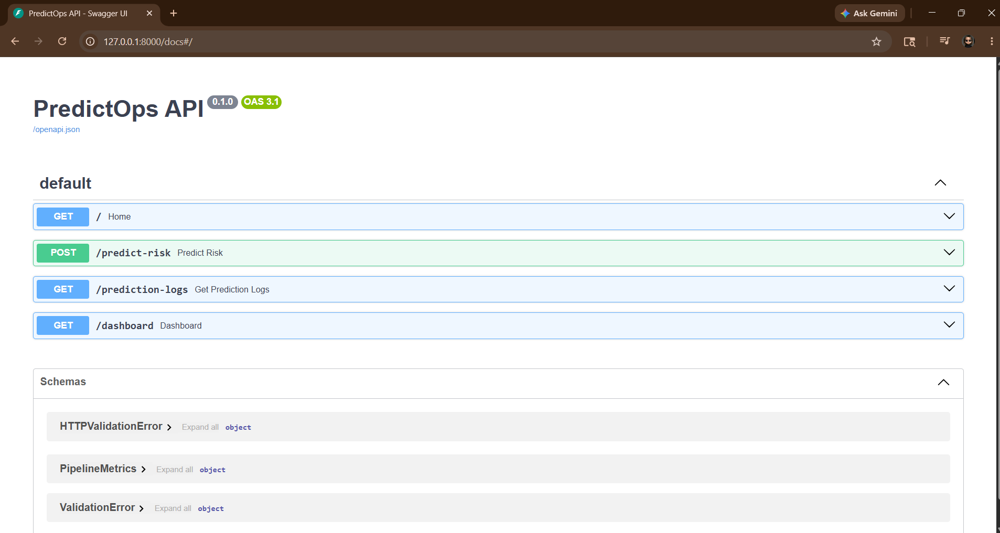

### Slack Alert Integration
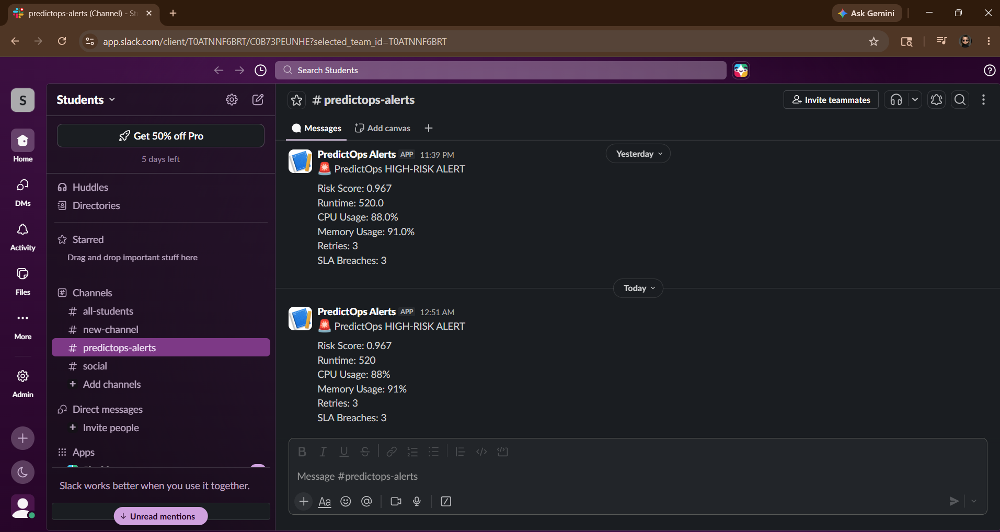

### Swagger API
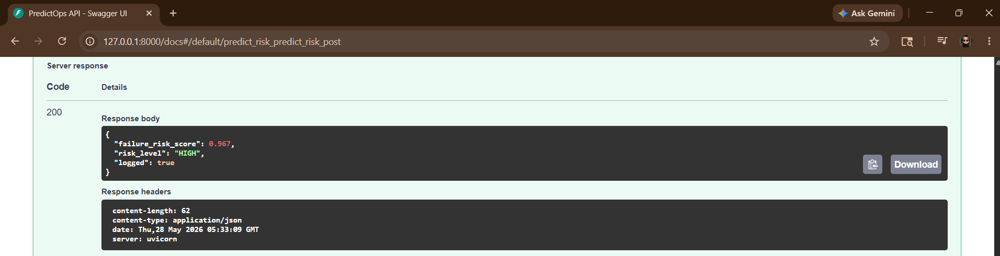

### Dockerized Deployment
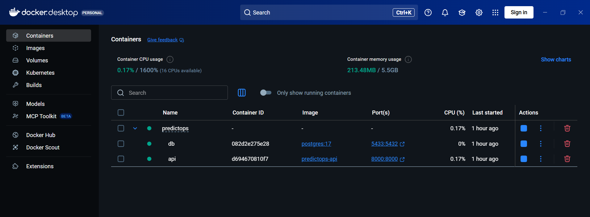

---

## Monitoring Dashboard

### Grafana Dashboard
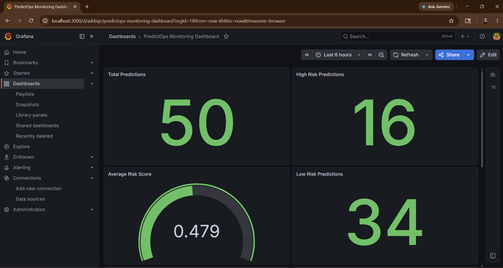

### Risk Distribution
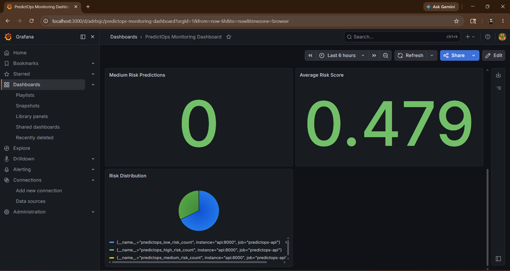

### Prometheus Targets
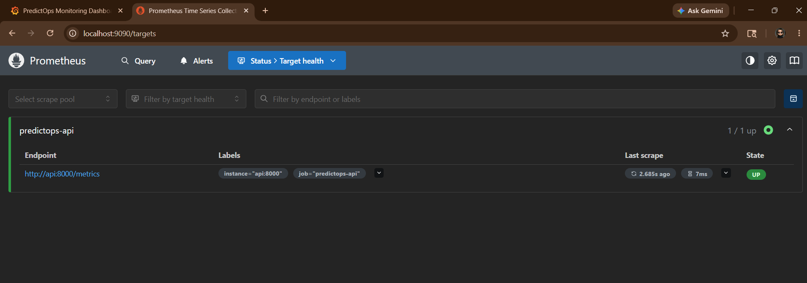

### Prometheus Metrics
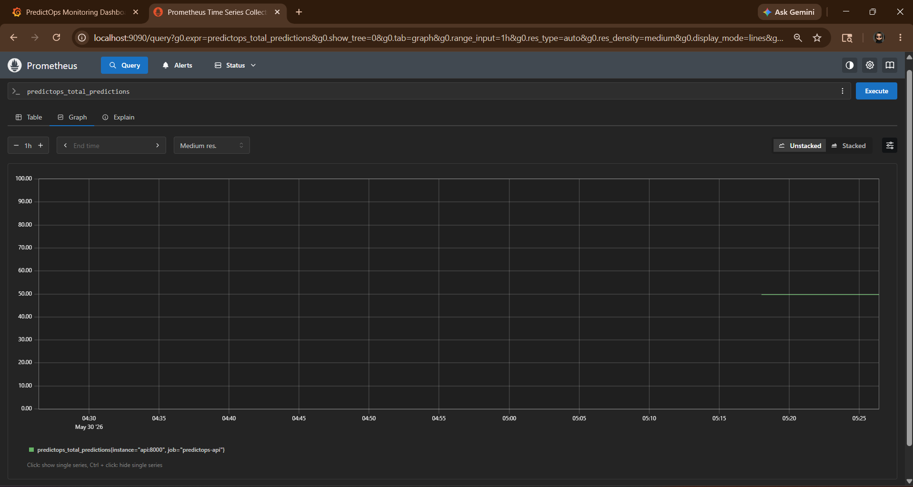

### API Health Endpoint
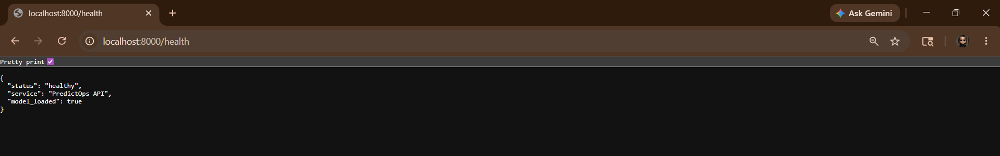

### Metrics Endpoint
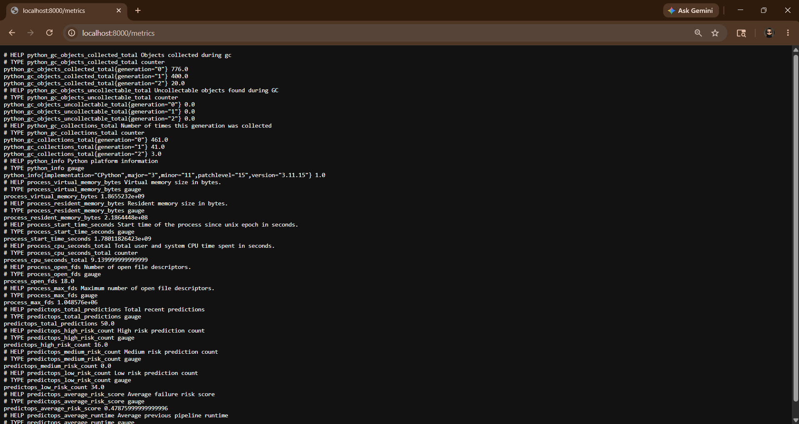

### Docker Containers
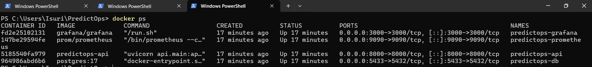

---

## Airflow Pipeline Orchestration

### Airflow DAG Overview
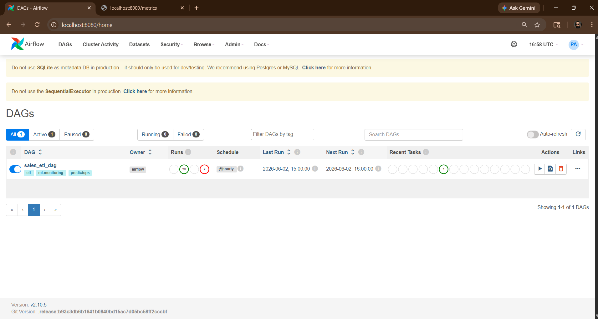

### Airflow Execution History
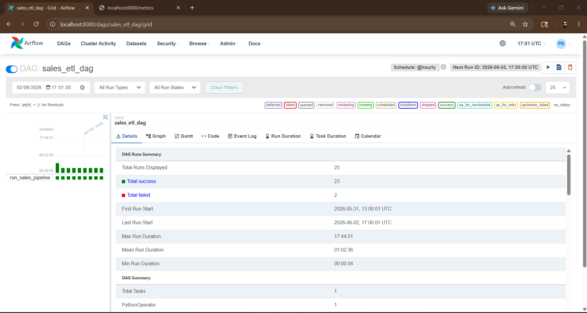

---

## Prometheus Monitoring

### Prometheus Metrics Query
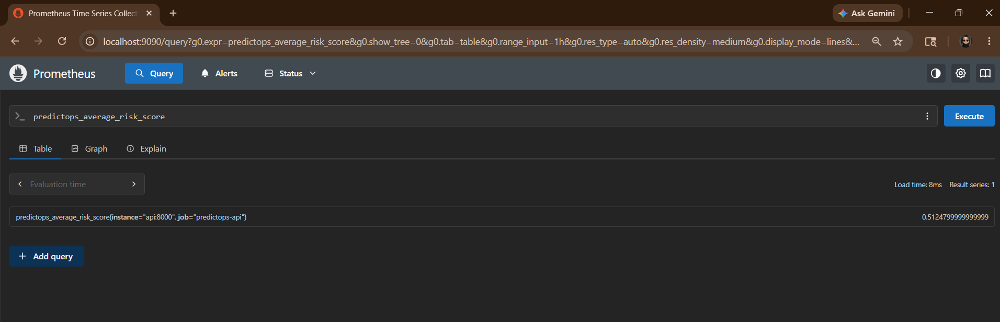

---

## Grafana Observability

### Executive Dashboard
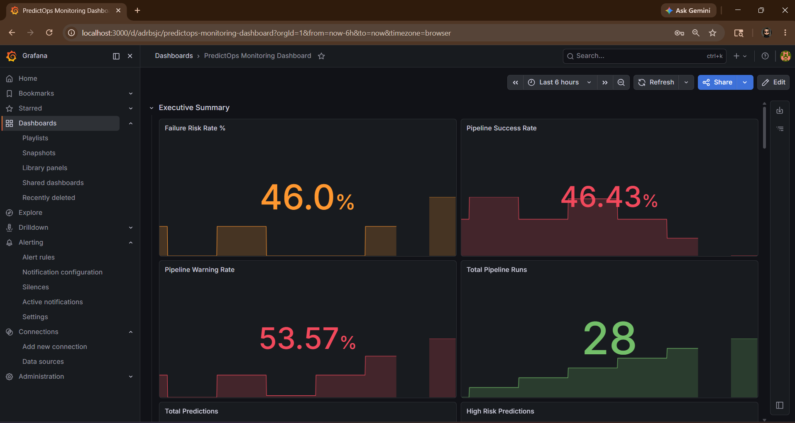

### Pipeline Performance
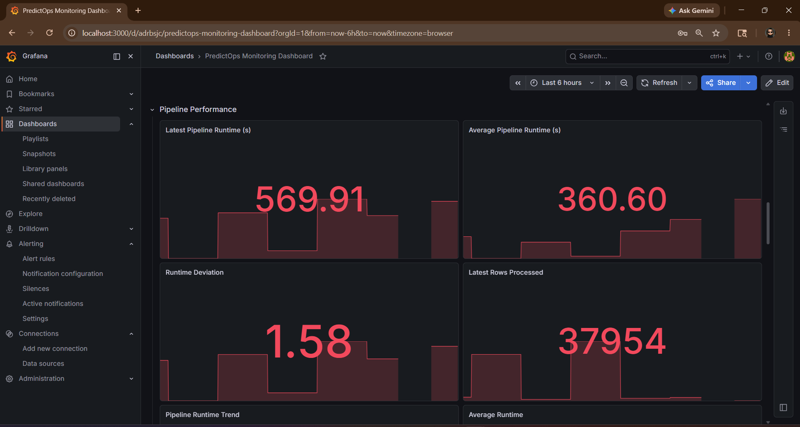

### Resource Monitoring
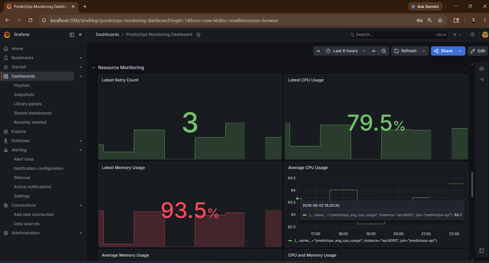

### AI Analytics Dashboard
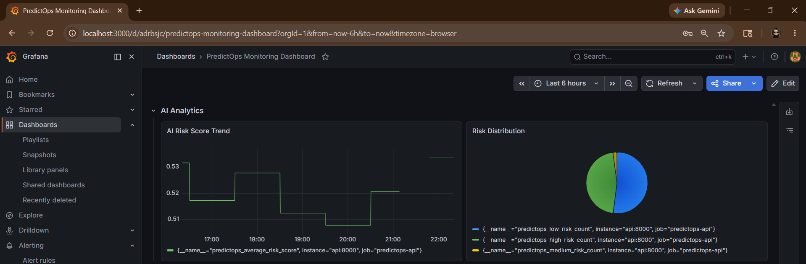

---

## Incident Alerting

### Discord High Risk Alert
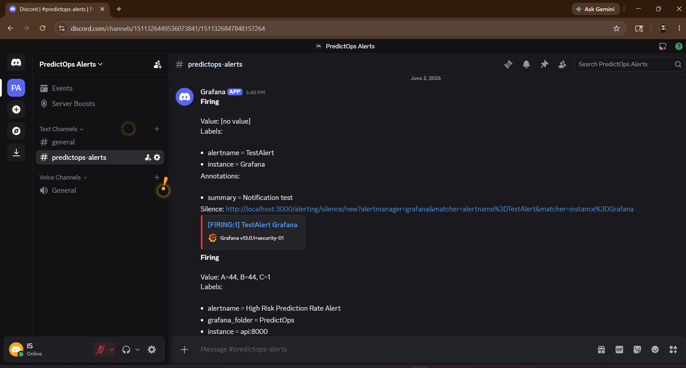

### Discord Alert Resolution


---

## MLflow

### Experiment Tracking
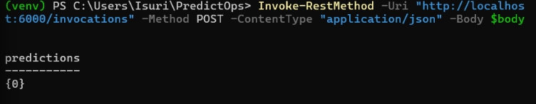

### Model Registry
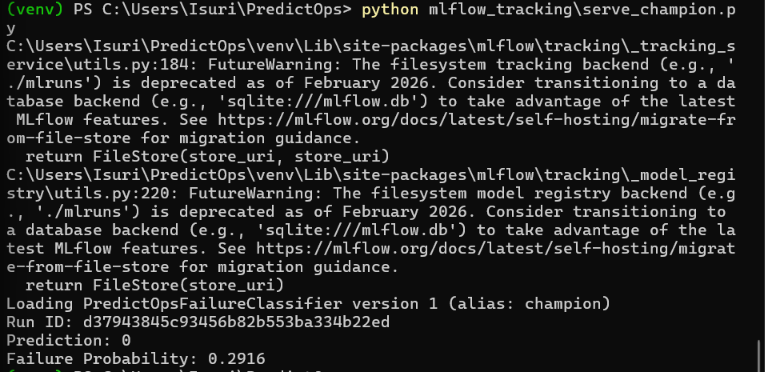


## Project Status

PredictOps is a complete end-to-end predictive data reliability platform.

✅ Machine learning failure prediction  
✅ MLflow experiment tracking  
✅ MLflow model registry with champion alias  
✅ Alias-based model loading at serve time  
✅ FastAPI prediction service  
✅ PostgreSQL operational data storage  
✅ Airflow ETL orchestration  
✅ Prometheus metrics collection  
✅ Grafana dashboards  
✅ Grafana alert management  
✅ Discord alert notifications  
✅ Dockerized deployment  
